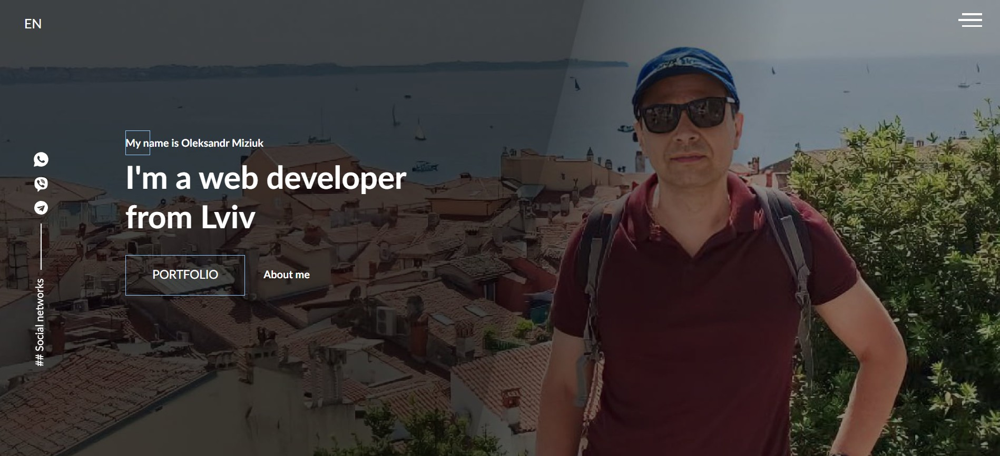
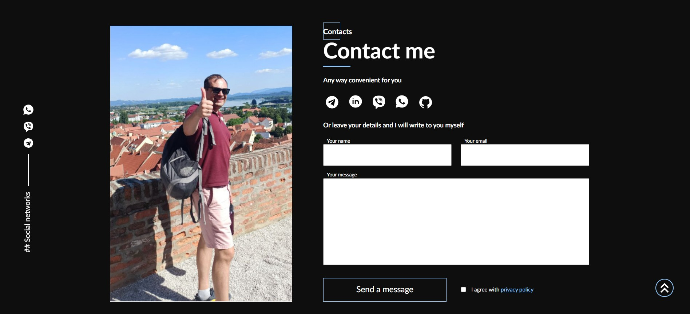

# 🌐 Personal Portfolio — Oleksandr Miziuk

A personal portfolio website of **Oleksandr Miziuk**, a web developer from Lviv.  
The site presents my professional skills, experience, and approach to building modern, aesthetic, and functional websites.

---

## ✨ About the Project
This portfolio was created to demonstrate my experience in:
- Frontend development (React, JavaScript, SCSS)
- UI/UX design
- Building responsive, fast, and user-friendly websites

It also serves as a digital CV and a showcase of my personal projects.

---

## 🔧 Technologies Used

- **React 18**
- **SASS / SCSS**
- **SweetAlert** — for elegant popups
- **Animate.css** - CSS library for adding animations to page elements  
- **WOW.js** — for scroll animations  
- **EmailJS** — for contact form integration  
- **Webpack** — module bundler  
- **LocalForage, Match Sorter, Sort-by** — utilities  
- **Jest, React Testing Library** — for testing

---

## 🚀 Features
- Multilingual structure (Slovenian)
- Clean and minimalistic design
- Responsive layout
- Information about worship services and Bible study meetings
- Contact details and location

---

## 📸 Screenshots / Demo
  
  

**Live Demo:** [View Website](https://my-portfolio-aeb86.web.app/)

---

## 💻 Local Setup
To run the project locally:

```bash
git https://github.com/alexmiziuk/My-portfolio.git
cd My-portfolio
npm install

```

---

🧰 **Build Modes**

In the **"scripts"** section, several commands are defined for different environments:

| Command | Description |
|----------|--------------|
| **npm start** | Runs the app in development mode using the local development server |
| **npm run build** | Builds the app for production (optimized and minified) |
| **npm test** | Launches the test runner in interactive watch mode |
| **npm run eject** | Exposes the configuration files for full control (this action is irreversible) |

---

## 📄 License
MIT License © Oleksandr Miziuk

---

## ✉ Контакты
* **Email:** oleksandr.miziyk@gmail.com
* **GitHub:** [github.com/alexmiziuk](https://github.com/alexmiziuk)